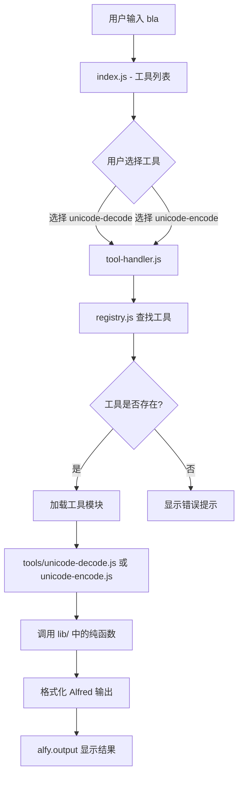

# 技术设计文档 — Alfred Toolkit Unicode Decode/Encode

## 概述

本设计文档描述 Alfred Toolkit 项目的技术架构和实现方案。该项目是一个统一的 Alfred workflow，通过关键词 `bla` 唤起，提供多种开发者实用工具。当前工具集包含 Unicode 解码（unicode-decode）和 Unicode 编码（unicode-encode）两个工具。

项目采用 Node.js ES modules 格式，使用 alfy 库作为 Alfred workflow 开发框架，参考现有 `alfred-png-to-webp` 项目的模式。核心设计目标是可扩展性——通过工具注册表（Tool Registry）和模块化的工具目录结构，使新增工具只需创建模块并注册即可。

### 设计决策

1. **两级交互模式**：第一级通过 `bla` 关键词显示工具列表，第二级通过 Alfred 的 Script Filter 链式调用进入具体工具。选择此方案是因为 Alfred 原生支持 Script Filter 的链式调用，用户体验流畅。
2. **工具注册表采用静态配置**：使用 JS 模块导出工具元数据数组，而非动态扫描目录。原因是工具数量有限，静态配置更简单可靠，且便于控制工具顺序和元数据。
3. **纯函数核心逻辑**：将 Unicode 编解码的核心逻辑抽取为纯函数，与 Alfred 输出格式化分离。这样便于单元测试和复用。
4. **转义字符处理集成在解码流程中**：`\n`、`\t` 等常见转义字符在 Unicode 解码的同一流程中处理，避免多次遍历字符串。

## 架构

### 项目目录结构

```
alfred-toolkit/
├── package.json
├── index.js                  # 第一级入口：工具列表展示
├── tool-handler.js           # 第二级入口：工具路由与执行
├── registry.js               # 工具注册表
├── tools/
│   ├── unicode-decode.js     # Unicode 解码工具模块
│   └── unicode-encode.js     # Unicode 编码工具模块
├── lib/
│   ├── unicode-decoder.js    # Unicode 解码核心逻辑（纯函数）
│   └── unicode-encoder.js    # Unicode 编码核心逻辑（纯函数）
├── info.plist                # Alfred workflow 配置
└── node_modules/
```

### 架构流程图



### Alfred Workflow 配置

Alfred workflow 需要配置两个 Script Filter 节点：

1. **第一级 Script Filter**：关键词 `bla`，执行 `node index.js "{query}"`，显示工具列表
2. **第二级 Script Filter**：由第一级的选择结果触发，执行 `node tool-handler.js "{query}"`，显示工具处理结果

第一级列表项的 `arg` 字段传递工具 ID，第二级通过 `{query}` 接收 `工具ID 用户输入` 格式的参数。

为支持快捷方式（如 `bla unicode-decode \u4f60\u597d`），第一级 Script Filter 需要检测输入是否匹配已注册工具名称，若匹配则直接将参数传递给对应工具处理。

## 组件与接口

### 1. 工具注册表 (registry.js)

```javascript
// registry.js
export const tools = [
  {
    id: 'unicode-decode',
    name: 'Unicode Decode',
    description: '将 Unicode 编码字符串（如 \\u4f60\\u597d）解码为可读文本',
    icon: { path: 'icons/decode.png' },
    module: './tools/unicode-decode.js'
  },
  {
    id: 'unicode-encode',
    name: 'Unicode Encode',
    description: '将普通文本编码为 Unicode 转义序列',
    icon: { path: 'icons/encode.png' },
    module: './tools/unicode-encode.js'
  }
];

export function findTool(id) { /* 根据 id 查找工具 */ }
export function filterTools(query) { /* 根据 query 模糊匹配工具 */ }
```

### 2. 第一级入口 (index.js)

```javascript
// index.js - 工具列表展示
import alfy from 'alfy';
import { tools, filterTools, findTool } from './registry.js';

// 解析输入：检测是否为快捷方式调用
// 输入格式: "过滤文本" 或 "工具ID 参数"
// 输出: Alfred 列表项数组
```

**接口**：
- 输入：`alfy.input`（用户在 `bla` 后输入的文本）
- 输出：`alfy.output(items)` — Alfred 列表项数组

### 3. 第二级入口 (tool-handler.js)

```javascript
// tool-handler.js - 工具路由与执行
import alfy from 'alfy';
import { findTool } from './registry.js';

// 解析输入：从 query 中提取工具 ID 和用户参数
// 动态导入工具模块并执行
```

**接口**：
- 输入：`alfy.input`（格式为 `工具ID 用户参数`）
- 输出：`alfy.output(items)` — 工具处理结果的 Alfred 列表项数组

### 4. 工具模块接口

每个工具模块导出统一的 `run` 函数：

```javascript
/**
 * @param {string} input - 用户输入的参数
 * @returns {Array<AlfredItem>} Alfred 列表项数组
 */
export async function run(input) { /* ... */ }
```

### 5. Unicode 解码核心逻辑 (lib/unicode-decoder.js)

```javascript
/**
 * 解码包含 Unicode 转义序列的字符串
 * @param {string} input - 包含 \uXXXX 转义序列的字符串
 * @returns {DecodeResult} 解码结果
 */
export function decodeUnicode(input) { /* ... */ }

/**
 * 替换可见占位符用于显示
 * @param {string} text - 解码后的文本
 * @returns {string} 替换了不可见字符的显示文本
 */
export function toDisplayText(text) { /* ... */ }
```

### 6. Unicode 编码核心逻辑 (lib/unicode-encoder.js)

```javascript
/**
 * 将文本中的非 ASCII 字符编码为 Unicode 转义序列
 * @param {string} input - 普通文本
 * @returns {EncodeResult} 编码结果
 */
export function encodeUnicode(input) { /* ... */ }
```

## 数据模型

### AlfredItem

Alfred 列表项的标准数据结构，遵循 alfy 库的输出格式：

```typescript
interface AlfredItem {
  uid: string;           // 唯一标识符
  title: string;         // 标题（主要显示内容）
  subtitle: string;      // 副标题（辅助信息）
  arg: string;           // 传递给下一步的参数
  icon?: { path: string }; // 图标路径
  valid?: boolean;       // 是否可选择（默认 true）
}
```

### ToolDefinition

工具注册表中的工具定义：

```typescript
interface ToolDefinition {
  id: string;            // 工具唯一标识（如 'unicode-decode'）
  name: string;          // 工具显示名称
  description: string;   // 工具描述
  icon: { path: string }; // 工具图标
  module: string;        // 工具模块路径
}
```

### DecodeResult

Unicode 解码结果：

```typescript
interface DecodeResult {
  decoded: string;       // 解码后的原始文本（包含实际换行符等）
  display: string;       // 用于显示的文本（不可见字符替换为占位符）
  hasSpecialChars: boolean; // 是否包含不可见/控制字符
  hasUnicodeSequences: boolean; // 原始输入是否包含 Unicode 转义序列
}
```

### EncodeResult

Unicode 编码结果：

```typescript
interface EncodeResult {
  encoded: string;       // 编码后的 Unicode 转义序列字符串
  hasNonAscii: boolean;  // 原始输入是否包含非 ASCII 字符
}
```


## 正确性属性 (Correctness Properties)

*属性（Property）是在系统所有有效执行中都应成立的特征或行为——本质上是对系统应做什么的形式化陈述。属性是人类可读规范与机器可验证正确性保证之间的桥梁。*

### Property 1: 编码-解码 Round Trip

*For any* 有效的 Unicode 字符串（包含 BMP 字符和补充平面字符的任意组合），先用 `encodeUnicode` 编码再用 `decodeUnicode` 解码，应得到与原始字符串等价的结果。

**Validates: Requirements 3.1, 3.2, 3.3, 3.5, 4.1, 4.2, 4.3**

### Property 2: 解码大小写不敏感

*For any* 有效的 Unicode 码点，其 `\uXXXX` 转义序列的大写形式（如 `\u4F60`）和小写形式（如 `\u4f60`）解码后应产生相同的字符。

**Validates: Requirements 3.4**

### Property 3: 不完整转义序列保留

*For any* 包含不完整 Unicode 转义序列（如 `\u4f6`、`\u`、`\u4f` 等）的字符串，`decodeUnicode` 应保留不完整部分原样输出，同时正确解码所有完整的 `\uXXXX` 序列。

**Validates: Requirements 6.2**

### Property 4: 不可见字符显示替换

*For any* 包含换行符（`\n`）或制表符（`\t`）的文本，`toDisplayText` 应将所有换行符替换为 `↵`、所有制表符替换为 `→`，且不改变其他字符。

**Validates: Requirements 5.5, 7.3**

### Property 5: 工具列表格式一致性

*For any* 工具注册表中的工具定义集合，生成的 Alfred 列表项中每个工具的 `title` 应等于该工具的 `name`，`subtitle` 应等于该工具的 `description`。

**Validates: Requirements 2.2**

### Property 6: 工具过滤正确性

*For any* 工具注册表和任意过滤查询字符串，`filterTools` 返回的结果应是原始工具列表的子集，且结果中每个工具的名称或描述应包含查询字符串（模糊匹配）。

**Validates: Requirements 2.3**

### Property 7: 空白输入拒绝

*For any* 仅由空白字符（空格、制表符、换行符等）组成的字符串，Unicode 解码器和编码器的 `run` 函数应返回包含提示信息的结果，而非尝试处理。

**Validates: Requirements 6.1, 6.4**

### Property 8: 纯 ASCII 输入检测

*For any* 仅包含 ASCII 字符（码点 0-127）的非空字符串，`encodeUnicode` 的结果应与原始字符串完全相同（无需编码），且 `hasNonAscii` 应为 `false`。

**Validates: Requirements 6.5**

## 错误处理

### 错误分类与处理策略

| 错误场景 | 处理方式 | 用户提示 |
|---------|---------|---------|
| 空/空白输入（解码器） | 返回引导提示项 | "请输入包含 \\uXXXX 格式的 Unicode 编码字符串" |
| 空/空白输入（编码器） | 返回引导提示项 | "请输入待编码的文本" |
| 不完整转义序列 | 保留原样，解码有效部分 | 正常显示结果 |
| 无 Unicode 转义序列 | 返回原始文本 | 副标题提示"未检测到 Unicode 转义序列" |
| 纯 ASCII 输入（编码器） | 返回原始文本 | 副标题提示"所有字符均为 ASCII，无需编码" |
| 工具未找到 | 返回错误提示项 | "未找到工具: {toolId}" |
| 未预期异常 | try-catch 捕获 | 显示错误描述，使用 alfy.icon.error 图标 |

### 错误输出格式

所有错误提示项遵循统一格式：

```javascript
{
  uid: 'error-{type}',
  title: '⚠️ {错误标题}',
  subtitle: '{错误描述或引导信息}',
  icon: { path: alfy.icon.warning },  // 或 alfy.icon.error
  valid: false
}
```

### 防御性编程

- 所有工具模块的 `run` 函数使用 try-catch 包裹，确保不会因未预期异常导致 Alfred 无输出
- `tool-handler.js` 在动态导入工具模块时捕获导入失败错误
- `decodeUnicode` 使用正则表达式匹配，不会因格式错误的输入抛出异常

## 测试策略

### 双重测试方法

本项目采用属性测试（Property-Based Testing）与单元测试（Example-Based Testing）相结合的策略：

- **属性测试**：验证核心编解码逻辑的通用正确性，覆盖大量随机输入
- **单元测试**：验证具体示例、边界情况和 UI 展示格式

### 属性测试配置

- **测试库**：[fast-check](https://github.com/dubzzz/fast-check)（Node.js 生态中最成熟的 PBT 库）
- **测试框架**：使用项目的测试框架（建议 vitest，与 ES modules 兼容性好）
- **每个属性最少 100 次迭代**
- **标签格式**：`Feature: alfred-toolkit-unicode-decode, Property {number}: {property_text}`

### 属性测试覆盖

| 属性 | 测试目标 | 生成器 |
|-----|---------|-------|
| Property 1: Round Trip | `encodeUnicode` + `decodeUnicode` | `fc.string16bits()`, `fc.fullUnicode()` |
| Property 2: 大小写不敏感 | `decodeUnicode` | 随机生成大小写混合的 `\uXXXX` 序列 |
| Property 3: 不完整序列保留 | `decodeUnicode` | 随机生成包含不完整序列的字符串 |
| Property 4: 显示替换 | `toDisplayText` | `fc.string()` 中混入 `\n` 和 `\t` |
| Property 5: 列表格式 | 工具列表生成逻辑 | 随机 `ToolDefinition` 数组 |
| Property 6: 过滤正确性 | `filterTools` | 随机工具列表 + 随机查询字符串 |
| Property 7: 空白拒绝 | `run` 函数 | `fc.stringOf(fc.constantFrom(' ', '\t', '\n', '\r'))` |
| Property 8: ASCII 检测 | `encodeUnicode` | `fc.ascii()` |

### 单元测试覆盖

| 测试场景 | 测试目标 |
|---------|---------|
| 具体解码示例 | `\u4f60\u597d` → `你好` |
| 混合内容解码 | `hello\u4e16\u754c` → `hello世界` |
| 代理对解码 | `\uD83D\uDE00` → `😀` |
| 转义字符处理 | `\n` → 换行符, `\t` → 制表符 |
| 空输入提示 | 空字符串 → 引导提示 |
| 无转义序列提示 | `hello` → 原文 + 提示 |
| 纯 ASCII 编码提示 | `hello` → 原文 + 提示 |
| 工具未找到 | 无效工具 ID → 错误提示 |
| 快捷方式路由 | `unicode-decode \u4f60` → 正确路由 |
| 表情符号前缀 | 解码结果以 ✅ 开头，编码结果以 🔤 开头 |
